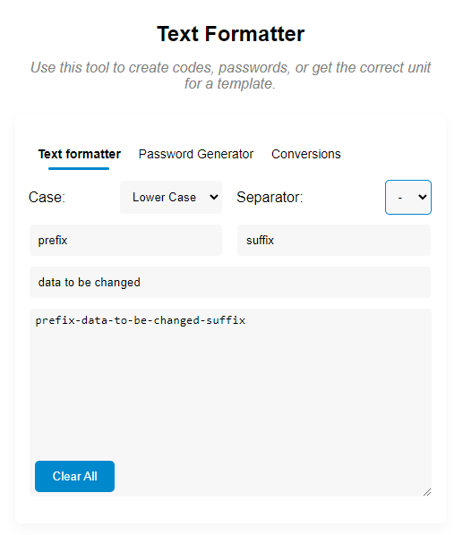
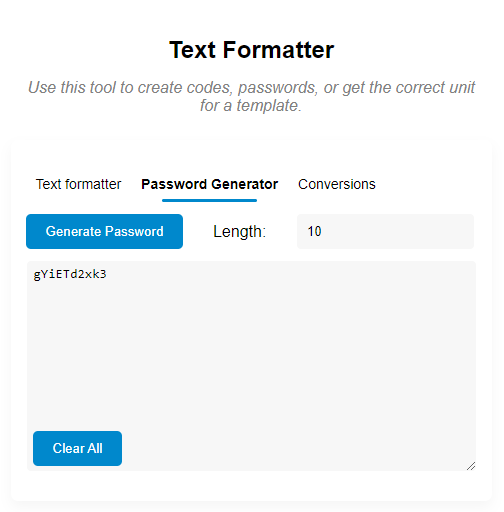
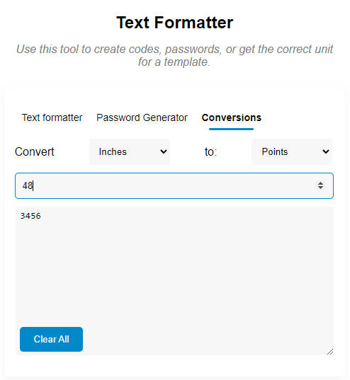

# Text Formatter Extension
> This project is to help speed up certain text formatting processes and includes other tools for different situations like creating a password, and figuring out conversions.
> Live demo [_here_](https://www.example.com). <!-- If you have the project hosted somewhere, include the link here. -->

## Table of Contents
* [General Info](#general-information)
* [Technologies Used](#technologies-used)
* [Features](#features)
* [Screenshots](#screenshots)
* [Setup](#setup)
* [Usage](#usage)
* [Project Status](#project-status)
* [Room for Improvement](#room-for-improvement)
* [Acknowledgements](#acknowledgements)
* [Contact](#contact)
<!-- * [License](#license) -->

## General Information
- This extension was built to help me speed up creating code names and SKUs for products. I also wanted to make my own chrome extension since I have never built one before.

## Technologies Used
- HTML 5
- CSS3
- Javascript
- jQuery

## Features
List the ready features here:
- Text formatter with changing text to different case, adding separators, a prefix, and suffix. 
- Password Generator
- Conversion tool for inches, feet, millimeters, centimeters, and points

## Screenshots

## Setup
To run the app it is very simple. You can either Download this repo and run the HTML file in the browser by double clicking it, or install the extension here: 

## Usage
Use this app for formatting text to create SKU's, codes, add prefixes, generate passwords, and do conversions.

## Project Status
Project is: _in progress_

## Room for Improvement
Room for improvement:
- Add CSV functionality, copy cells from csv or excel and return formatted values

## Acknowledgements
- This project was inspired by my Job and by my CodePen project [@Underscore It](https://codepen.io/ruffmantom/pen/ExpNZEx)

## Contact
Created by [@ruffmantom](https://github.com/Ruffmantom) - feel free to contact me!