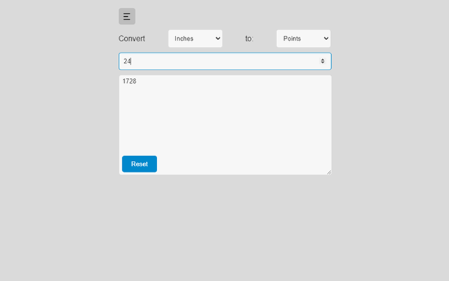

# Text Formatter Extension
> This project is to help speed up certain text formatting processes and includes other tools for different situations like creating a password, and figuring out conversions.
> Live demo [_here_](https://chromewebstore.google.com/detail/labcloud-tool/ddccphibkibcaidgdchlacfhbncojejg?hl=en).

## Table of Contents
* [General Info](#general-information)
* [Technologies Used](#technologies-used)
* [Features](#features)
* [Screenshots](#screenshots)
* [Setup](#setup)
* [Usage](#usage)
* [Project Status](#project-status)
* [Room for Improvement](#room-for-improvement)
* [Acknowledgments](#acknowledgments)
* [Contact](#contact)
<!-- * [License](#license) -->

## General Information
- This extension was originally built to help me speed up creating code names and SKUs for products. Now I've added 4 other tools that help with creating products, keeping track of my tasks and more. I have also always wanted to make my own Chrome extension and thought this would be a great one to try.

## Technologies Used
- HTML 5
- CSS3
- Javascript
- jQuery

## Features
- Format different types of SKUs, Names and codes. Allows for line breaks to easily work with multiple lines from a spreadsheet.
- Since 6.1, Added the Page Option tool where you can easily adjust the order of page options and rename them if needed. As well as adding new page options.
- The Color Tool allows you to get CMYK and RGB values when a HEX color code is entered. This is specifically for CloudLabs backend when creating colors.
- The Conversion tool allows you to convert numbers for millimeters, centimeters, inches, feet, yards, and points. This is to aid in the creation of templates.
- Since 6.0, Added the To Do's tool. This is a pretty standard to-do list, very similar to other applications where you can set a due date, have multiple lists, re-type the list name and to-do's etc.
- Since 6.0, Added the notes tool. This tool allows you to save any important info for later, similar to a sticky note.

## Screenshots

## Setup
To run the app it is very simple. You can either download this repo and run the HTML file in the browser by double-clicking it, or install the extension here: [Chrome Extension](https://chromewebstore.google.com/detail/labcloud-tool/ddccphibkibcaidgdchlacfhbncojejg?hl=en)

## Usage
Use this app for formatting text to create SKU's, and codes, add prefixes, generate passwords, and do conversions. Since 6.0 Just recently added the ability to add to-do lists, and notes and now in 6.1 added a tool to help with page options. Sorting them and renaming them.

## Project Status
The project is: _in progress_

## Room for Improvement
Room for improvement:
- Add CSV functionality, copy cells from CSV or Excel and return formatted values
- Continue to add tools that will help speed up the process of creating products, codes, names, and more.

## Acknowledgments
- This project was inspired by my Job and by my CodePen project [@Underscore It](https://codepen.io/ruffmantom/pen/ExpNZEx)

## Contact
Created by [@ruffmantom](https://github.com/Ruffmantom) - feel free to contact me also at [Email](tomruffcodes@gmail.com)